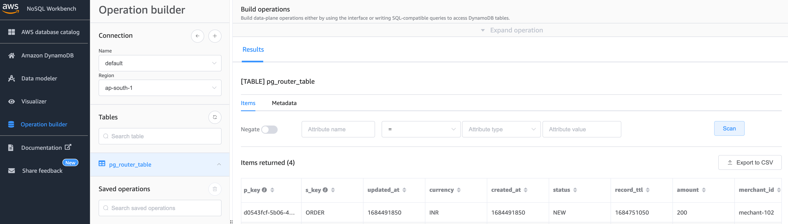
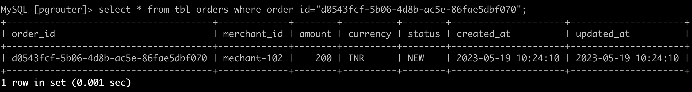

# DynamoDB to RDS

## Problem Statement

Most of the APIs are backed by RDBMS of some flavor (MySql, Postgres, MSSQL, etc.)

It is difficult to scale RDBMS. Only way to scale is either to scale up (getting a larger box), 
or scale out by sharding / partitioning. Each of the approaches has its own challenges and problems.

As many of the projects are way too invested in their RDBMS (other systems depending on the data being available in RDBMS),
it is not easy and sometimes feasible to replace the RDBMS immediately.

## Possible Solution

To handle the ever-increasing load on the API, we are going to front the data layer with `DynamoDB`, which was built for scale.

We use `DynamoDB Streams` to consume the `CDC Stream` and sync it back to `RDBMS` using `Lambdas`

## System Design


## Components

### API

Simple REST API to simulate `POST` calls

### Consumer

Lambda logic for consuming the DynamoDB Stream

### Deployments

Terraform (IaC) Scripts for creating the AWS resources

## Pre-requisites

Even though most of the infrastructure are built as part of the deployment, 
some components are expected to be available in the AWS environment

* VPC
* RDS/Aurora Instance
* RDS Proxy (Optional)

## Building the Lambda Function

```shell
cd consumer
rm -rf  ../deployments/dist  && GOOS=linux GOARCH=amd64 CGO_ENABLED=0 go build -o ../deployments/dist/consumer/main
```

## Deploying AWS Infrastructure

**Note:** Next steps expects `Terraform` (v1.4+) to be installed on your workstation

### Initialise the Deployment

```shell
tf init \
-backend-config="bucket=<S3 Bucket Name>" \
-backend-config="key=<Object Key Path>" \
-backend-config="region=<AWS Region>"
```

### Validate the changes

```shell
tf plan -var 'aws_region=<AWS Region>' \
-var 'env=<Environment (dev/qa/prod)>' \
-var 'vpc_id=<VPC Id>' \
-var 'rds_sg_id=<Security Group Id of the RDS or RDS proxy>' \
-var 'rds_secret_arn=<Secrets Manager ARN which holds the RDS Credentials>' \
-var 'rds_connection_param_name=<SSM Parameter Store - RDS Connection Details>'
```

### Deploy the changes

```shell
tf apply -var 'aws_region=<AWS Region>' \
-var 'env=<Environment (dev/qa/prod)>' \
-var 'vpc_id=<VPC Id>' \
-var 'rds_sg_id=<Security Group Id of the RDS or RDS proxy>' \
-var 'rds_secret_arn=<Secrets Manager ARN which holds the RDS Credentials>' \
-var 'rds_connection_param_name=<SSM Parameter Store - RDS Connection Details>'
```

## Running the API Server

### Starting the server locally

```shell
# Define the Env Variables
export TABLE_NAME=<DynamoDB Table Name>
export GIN_MODE=release

# Build the Server
go build -o dist/

# Run the server
./dist/api
```
### Making a `POST` Request

```shell
curl --location 'http://localhost:8080/v1/orders' \
--header 'Content-Type: application/json' \
--header 'Authorization: Basic Zm9vOmJhcg==' \
--data '{
    "merchant_id": "merchant-102",
    "amount": 200.00,
    "currency": "INR"
}'
```

### Response 

```json
{
    "order_id": "d0543fcf-5b06-4d8b-ac5e-86fae5dbf070"
}
```

## Verifying the results

### Record available in `DynamoDB`



### Record available in `RDBMS`

