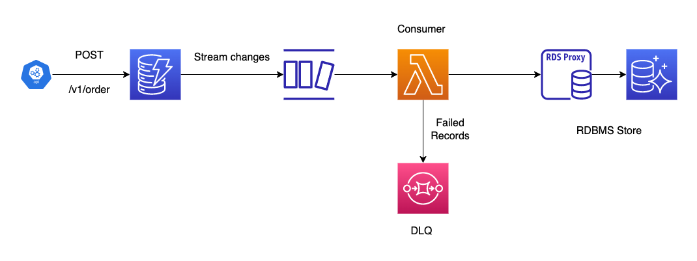

# DynamoDB to RDS

## Problem Statement

Most of the APIs are backed by RDBMS of some flavor (MySql, Postgres, MSSQL, etc.)

It is difficult to scale RDBMS. Only way to scale is either to scale up (getting a larger box), 
or scale out by sharding / partitioning. Each of the approaches has its own challenges and problems.

As many of the projects are way too invested in their RDBMS (other systems depending on the data being available in RDBMS),
it is not easy and sometimes feasible to replace the RDBMS immediately.

## Possible Solution

To handle the ever-increasing load on the API, we are going to front the data layer with `DynamoDB`, which was built for scale.

We use `DynamoDB Streams` to consume the `CDC Stream` and sync it back to `RDBMS` using `Lambdas`

## System Design

